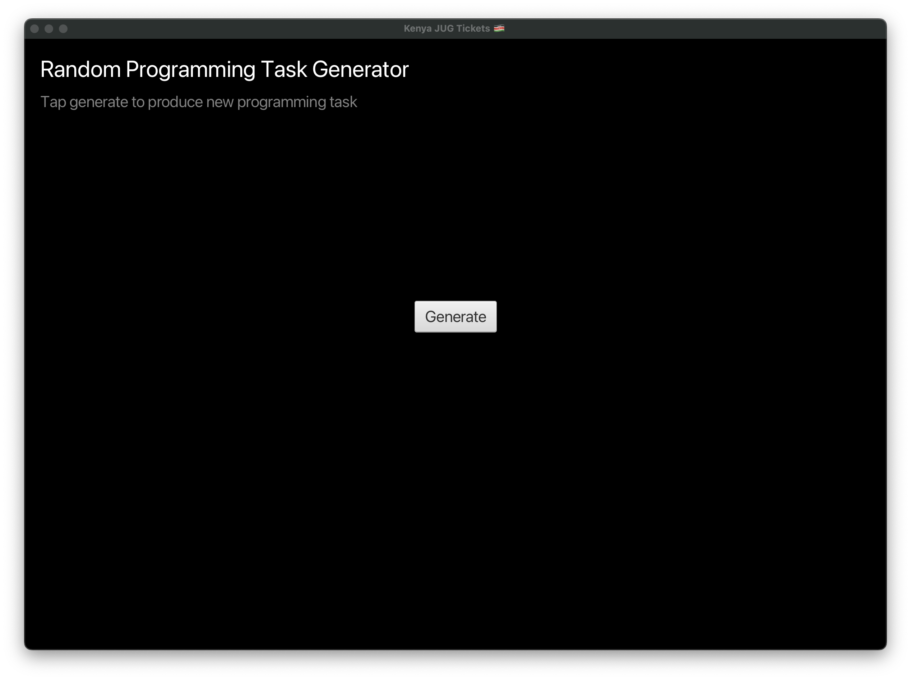
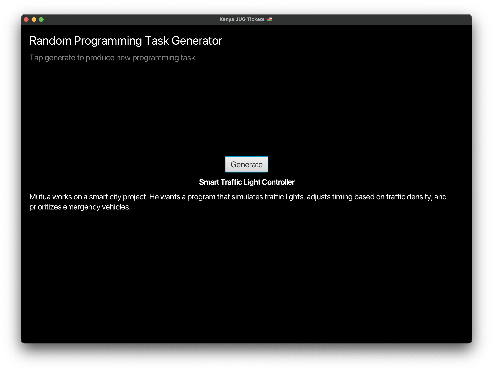

# Tickets
A random ticketing platform for practicing Java

## How to use
1. Open a terminal
2. Execute `run.sh`
```shell
$ bash run.sh
```




<!-- coverage start -->
## 📊 Code Coverage Report

**Overall Coverage: 74.12% ⚠️**

| Metric      | Covered | Missed | Total | Coverage  |
|-------------|---------|--------|-------|-----------|
| INSTRUCTION | 275     | 96     | 371   | 74.12% ⚠️ |
| LINE        | 71      | 23     | 94    | 75.53% ⚠️ |
| BRANCH      | 9       | 5      | 14    | 64.29% ⚠️ |
| METHOD      | 12      | 7      | 19    | 63.16% ⚠️ |
| CLASS       | 5       | 2      | 7     | 71.43% ⚠️ |
| COMPLEXITY  | 14      | 12     | 26    | 53.85% ⚠️ |
<!-- coverage end -->
